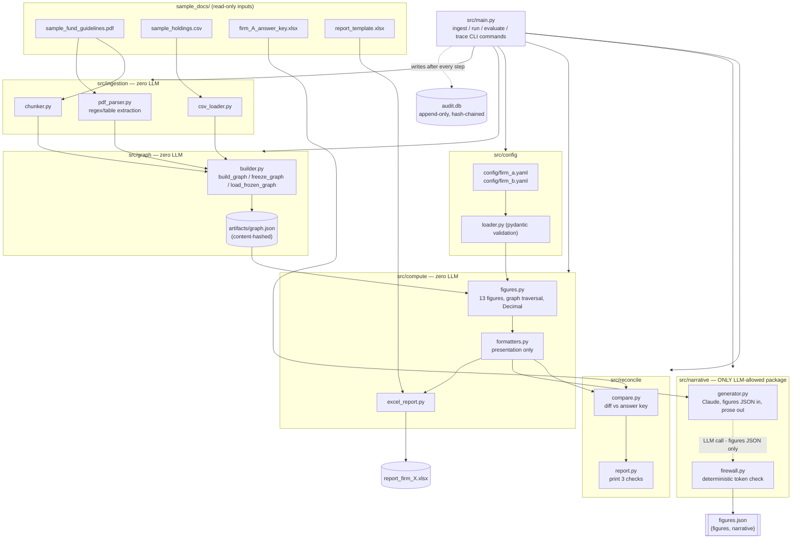

# Architecture

## Layers

Six layers, each a Python package under `src/`, plus the audit log. Layer
packages never touch the audit log themselves — `src/main.py`'s CLI commands
are the only code that imports `src.audit`, orchestrating each layer in turn
and recording what happened after each step. Arrows follow the direction
data actually flows at runtime, not import direction.

## Where the LLM may and may not appear

`anthropic` is imported in exactly one file in the whole project:
`src/narrative/generator.py`. `tests/test_no_llm_in_compute.py` parses the
AST of every file under `src/compute` and `src/graph` and fails if either
package ever imports `anthropic`, `openai`, `httpx`, or anything under
`src/narrative` — this isn't a convention, it's enforced.

| Layer | LLM allowed? | Why |
|---|---|---|
| Ingestion | No | Numeric limits come from regex/table parsing against a structured PDF. The architecture *supports* LLM-assisted extraction of non-numeric fields (breach-action text, owners) behind the same `extraction_confidence` human-review gate used for everything else — but in this implementation, the guidelines document's breach-action column parses cleanly with regex, so no LLM call actually happens during ingestion. See `docs/03_rfc.md` question 1 for why this matters even when unused. |
| Graph | Never | Pure data assembly from ingestion output. |
| Compute | Never | Every figure is `Decimal` arithmetic over graph traversal results. |
| Reconcile | Never | String comparison against the answer key. |
| Narrative | Yes | The only zone. Receives the already-computed, already-formatted `figures.json` list — never the CSV, the PDF, or the graph. |
| Firewall | No | Deterministic regex token extraction and set comparison, checking the narrative's own output — this specifically must not be another LLM call, or a hallucinated number could be "verified" by a second hallucination. |

## Why the graph sits between ingestion and compute

`run` never re-parses the PDF or CSV — it calls `builder.load_frozen_graph`,
which reads `artifacts/graph.json` and verifies its stored content hash
before trusting it. Ingestion happens once (`ingest`), is gated by a human
when confidence warrants it (`approve-graph`), and every subsequent `run` or
`evaluate` reads that same frozen, approved graph. This is what keeps
constraint 1 (reproducibility) true even though ingestion's non-numeric
extraction path is architecturally allowed to be LLM-assisted (LLMs aren't
deterministic) — by the time `run` executes, ingestion is already finished
and its output is frozen data, not a live process.
